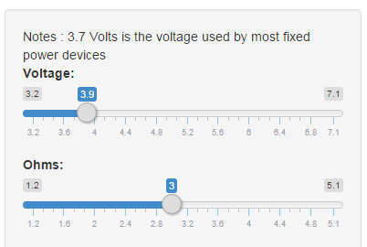
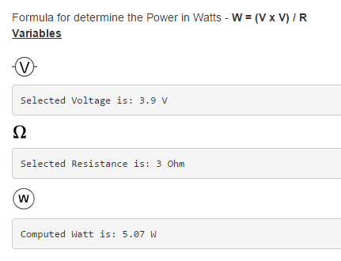
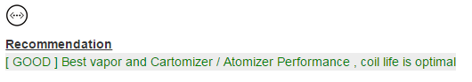
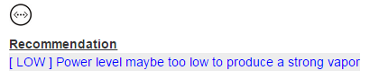

## Introduction

This application was designed for user as a safe guideline for setting a single coil cartomizers especially for a novice vapors who might not familiar with Ohm's Law to understand how ohms and voltage can affect one's vape experience.

The application  provide Safe Vaping Power chart which can be download in Excel format

The application do not promote for the user who are below 18+ years.

Copyright (c) 2015 PozyPakya

THE SOFTWARE IS PROVIDED "AS IS", WITHOUT WARRANTY OF ANY KIND, EXPRESS OR
IMPLIED, INCLUDING BUT NOT LIMITED TO THE WARRANTIES OF MERCHANTABILITY,
FITNESS FOR A PARTICULAR PURPOSE AND NONINFRINGEMENT. IN NO EVENT SHALL THE
AUTHORS OR COPYRIGHT HOLDERS BE LIABLE FOR ANY CLAIM, DAMAGES OR OTHER
LIABILITY, WHETHER IN AN ACTION OF CONTRACT, TORT OR OTHERWISE, ARISING FROM,
OUT OF OR IN CONNECTION WITH THE SOFTWARE OR THE USE OR OTHER DEALINGS IN
THE SOFTWARE.

--- .class #id 

## System requirement

The web application can be access from URL below :-

https://pozypakya.shinyapps.io/apps

# Compatible Browser
 

 

 

--- .class #id 

## Slider - Voltage and Ohms

 
You can slide and change between the value for desired value.
 

 
The value will automatically change if the slider moves. Computed watt is the output.

--- .class #id 
## Recommendation

 

 

 
3 types recommendation status will be shown based on the input provided.
 
Please set and follow the best recommendation or green status.

--- .class #id 
## Power Chart

 
You also may refer to the power chart provided and the table in Excel can be <a href="calculator.xlsx">download</a> here. The recommendation setting is which in green color .

--- .class #id 
## Reference
http://blog.v-ecigs.com/2014/03/what-voltagewattage-should-i-vape-at.html
 
http://www.tasteyourjuice.com/wordpress/volts-vs-ohms/
 
http://vapeordie.com/vape/voltage-wattage-chart/
 
http://www.vapertrain.com/page/utvvb
 
https://www.e-cigarette-forum.com/forum/threads/e-liquid-nicotine-consumption-table-vaping-method.344166/

## GitHub

--- .class #id 
## Thank You
Developing Data Products
Your Reproducible Pitch Presentation

OK, you've made your shiny app, now it's time to make your pitch. You get 5 slides (inclusive of the title slide)  to pitch a your app. You're going to create a web page using Slidify or Rstudio Presenter with an html5 slide deck.

Here's what you need :-

5 slides to pitch our idea done in Slidify or Rstudio Presenter
Your presentation pushed to github or Rpubs
A link to your github or Rpubs presentation pasted into the text box below
Your presentation must satisfy the following

<li>It must be done in Slidify or Rstudio Presenter</li>
<li>It must be 5 pages</li>
<li>It must be hosted on github or Rpubs</li>
<li>It must contained some embedded R code that gets run when slidifying the document</li>

